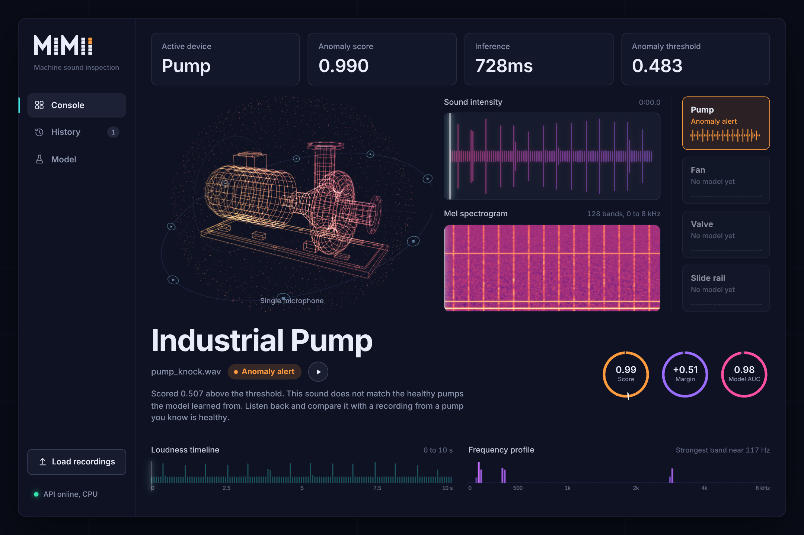

<p align="center"></p>

# MIMII Machine Failure Detection

Detects faulty industrial pumps from their sound. Upload a 10 second `.wav` recording and the system tells you whether the pump sounds healthy or abnormal, using CNN autoencoders trained on the [MIMII dataset](https://zenodo.org/records/3384388), a trained classifier vote, and a FastAPI backend with a web dashboard.

Course project, CSE_3125.



## Quick start

From the project root (Windows PowerShell shown; use `source .venv/bin/activate` on macOS/Linux):

```powershell
python -m venv .venv
.\.venv\Scripts\Activate.ps1
pip install -r requirements.txt
uvicorn main:app --reload
```

Then open **http://127.0.0.1:8000/** for the dashboard, or **http://127.0.0.1:8000/docs** for Swagger.

Drop one or more pump `.wav` files on the page. Each one is scored and listed under History.

> The first install takes a while. PyTorch is large, and on Windows the install step can sit silently for 5 to 15 minutes. Let it finish.

## Requirements

- Python 3.11, 3.12 or 3.13
- About 3 GB of disk space for the virtual environment
- A GPU is optional. The scorer uses CUDA when available and falls back to CPU automatically.

`scikit-learn` must stay at **1.6.1**. The trained combiner (`artifacts/pump_combiner.pkl`) was pickled with that version and will not load reliably with another.

<details>
<summary>Optional: NVIDIA GPU setup</summary>

Install the CUDA build of PyTorch after the normal install:

```powershell
pip uninstall torch -y
pip install torch --index-url https://download.pytorch.org/whl/cu130
```

Check it:

```powershell
python -c "import torch; print(torch.__version__, torch.cuda.is_available())"
```

The backend was verified on an RTX 4060 Laptop GPU with PyTorch 2.14.0+cu130 and on CPU.
</details>

<details>
<summary>PowerShell will not activate the venv</summary>

Run this once, then activate again:

```powershell
Set-ExecutionPolicy -ExecutionPolicy RemoteSigned -Scope CurrentUser
```
</details>

## How it works

```
.wav upload
  -> preprocessing        mono, 16 kHz, 10 s, log-mel spectrogram (128 x 313), normalised
  -> ConvAE v1 + ConvAE v2   each tries to rebuild the spectrogram of a healthy pump
  -> error features       mean, max, std and 90th percentile of per-frame rebuild error
  -> classifier vote      logistic regression, random forest, gradient boosting (AUC-weighted)
  -> anomaly score        compared with the trained threshold (0.4832)
  -> normal / anomalous
```

Only **pump** is scored right now. Fan, valve and slide rail can be opened in the dashboard as 3D views until their models are trained.

### Model performance (pump)

| Metric | Value |
|---|---|
| ROC-AUC, held-out test set | 0.977 |
| Precision / Recall / F1 at threshold | 0.908 / 0.908 / 0.908 |
| Cross-validated ROC-AUC | 0.947 ± 0.016 |

Approaches compared during training (cross-validated ROC-AUC):

| Approach | AUC |
|---|---|
| Two autoencoders + classifier vote (**in use**) | 0.947 |
| Autoencoder v2 alone | 0.845 |
| Averaged autoencoders | 0.662 |
| Autoencoder v1 alone | 0.362 |

## Project structure

```
mimii/
├── artifacts/                 trained model files (owned by the ML layer)
│   ├── manifest.json          preprocessing config, threshold, metrics
│   ├── pump_conv_ae_v1.pt
│   ├── pump_conv_ae_v2.pt
│   ├── pump_combiner.pkl
│   └── cv_metrics_summary.csv
├── common/                    ML code, single source of truth
│   ├── preprocessing.py       wav_to_logmel()
│   ├── models.py              ConvAutoencoderV1 / V2, build_model()
│   └── scoring.py             AnomalyScorer, the full inference pipeline
├── frontend/                  dashboard, plain HTML/CSS/JS, no build step
│   ├── index.html
│   ├── styles.css
│   ├── app.js                 API calls, upload queue, playback, charts
│   ├── dsp.js                 display-only waveform and spectrogram
│   ├── holo.js                3D wireframe machines (Three.js)
│   ├── assets/                logo, favicon, app icon
│   └── vendor/                Three.js, bundled so the demo works offline
├── docs/                      screenshots
├── main.py                    FastAPI app, also serves frontend/
├── requirements.txt
└── notebookc71a97b3e7.ipynb   training notebook
```

## Dashboard

Served by FastAPI at `/`, so nothing extra to run.

- Drag and drop or pick several `.wav` files. They are checked one at a time.
- Shows the anomaly score, threshold, margin and inference time, plus a healthy or anomaly state on the 3D pump.
- Waveform, mel spectrogram, loudness timeline and frequency profile stay in sync with audio playback. Click or drag to seek; Space plays and pauses.
- **History** lists every clip checked in the session.
- **Model** shows the metrics, confusion matrix and approach comparison above, read live from the artifacts.
- Select a machine card to switch the 3D view between pump, fan, solenoid valve and slide rail. Each has its own moving parts (impeller, rotor, plunger, carriage). Only the pump is scored; the others are previews.

The charts are drawn in the browser for display only, using the same mel settings as the model. The decision always comes from the backend.

### Running the frontend on its own server

Useful with VS Code Live Server (port 5500) or Vite (port 5173). The page then calls `http://127.0.0.1:8000` automatically. CORS already allows `localhost` on ports 5500, 5173 and 8000. To allow others:

```powershell
$env:CORS_ORIGINS="http://localhost:3000"; uvicorn main:app --reload
```

To point the page at a backend on another machine, add `?api=` to the URL:

```
index.html?api=http://192.168.1.20:8000
```

## API

Base URL: `http://127.0.0.1:8000`

### `GET /health`

```json
{ "status": "ok", "machines": ["pump"], "device": "cpu" }
```

### `POST /predict`

`multipart/form-data` with one field, `audio`, holding a `.wav` file up to 20 MB. Do **not** send a machine type; the backend uses pump.

```json
{
  "machine_type": "pump",
  "prediction": "anomalous",
  "anomaly_score": 0.9884,
  "threshold": 0.4832,
  "inference_ms": 42.3
}
```

`prediction` is `normal` or `anomalous`. A clip is anomalous when `anomaly_score >= threshold`.

Example:

```powershell
curl.exe -F "audio=@pump.wav;type=audio/wav" http://127.0.0.1:8000/predict
```

Errors:

| Status | When |
|---|---|
| 400 | File is not a `.wav`, or its content type is not WAV |
| 413 | File is larger than 20 MB |
| 500 | Inference failed. Details are printed in the backend terminal, not sent to the client |

Uploads are written to a temporary file for inference and deleted straight after. Nothing is stored.

### `GET /model-info`

Read-only model card used by the dashboard: architecture, threshold, ROC-AUC, precision, recall, F1, confusion matrix, preprocessing config, and the cross-validated comparison from `cv_metrics_summary.csv`.

## Testing the ML pipeline without the API

```powershell
python -c "from common.scoring import AnomalyScorer; s = AnomalyScorer('artifacts'); print(s.score(r'PATH_TO_WAV', 'pump'))"
```

Returns `machine_id`, `architecture`, `anomaly_score`, `threshold` and `is_anomaly`.

## Rules for contributors

- **Preprocessing is part of the model contract.** Always go through `common.preprocessing.wav_to_logmel()` via `AnomalyScorer`. Changing any parameter in `manifest.json` makes reconstruction errors meaningless, and nothing will raise an error to warn you.
- **The threshold belongs to the artifact.** The backend and frontend never choose their own.
- **`main.py` calls `AnomalyScorer`; it never reimplements scoring.** The frontend only calls the API.

| Layer | Files | Responsibility |
|---|---|---|
| ML | `common/`, `artifacts/`, notebook | preprocessing, models, training, threshold |
| Backend | `main.py` | upload validation, temp files, calling the scorer, JSON responses, serving the dashboard |
| Frontend | `frontend/` | upload, display, playback, visualisation |

## Troubleshooting

| Problem | Fix |
|---|---|
| `pip install` stuck on "Preparing metadata" for numpy | An old pinned version has no wheel for your Python. Pull the latest `requirements.txt`, which uses version ranges. |
| Install sits silently after "Installing collected packages" | Normal on Windows while PyTorch installs. Wait. |
| Dashboard says "API offline" | Start `uvicorn main:app --reload` from the project root, then select the status at the bottom of the sidebar to retry. |
| Combiner fails to load / sklearn warning | Run `pip install scikit-learn==1.6.1`. |
| Every clip scores as anomalous | Use real MIMII pump recordings. Synthetic or phone recordings sound nothing like the training data. |

## Current limitations

- Pump only.
- WAV input only, analysed for the first 10 seconds.
- Built for local demonstration: one request at a time, no authentication.
- Not yet Dockerized.

## Team

Suryansh Verma, Deepika Kanna, Divyam Saluja, Shiven Puri.

## License

MIT, see [LICENSE](LICENSE).
